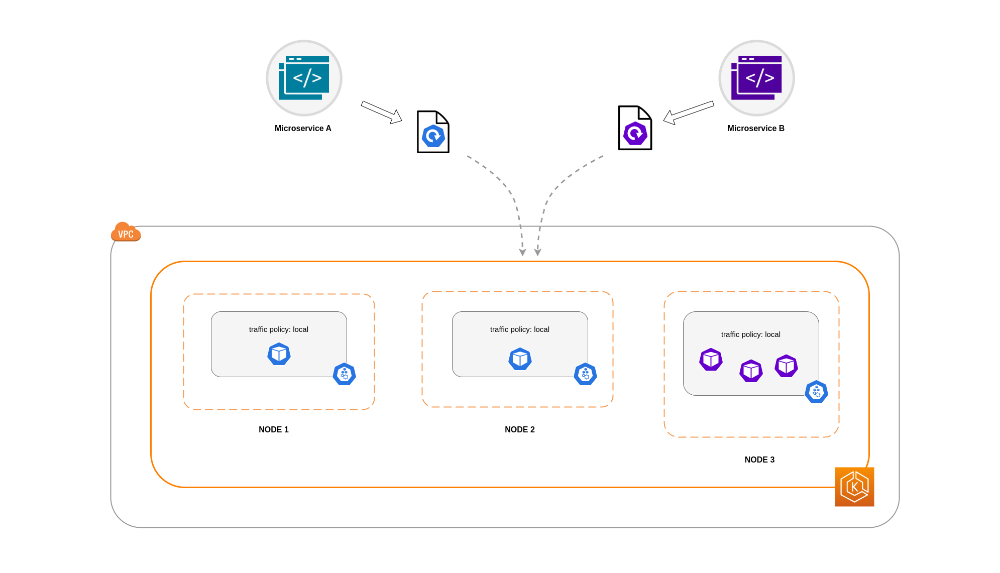
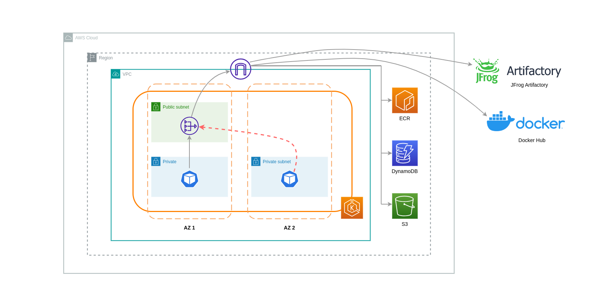
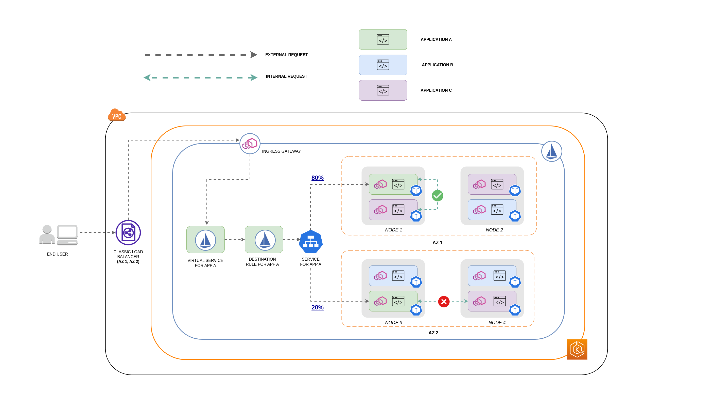
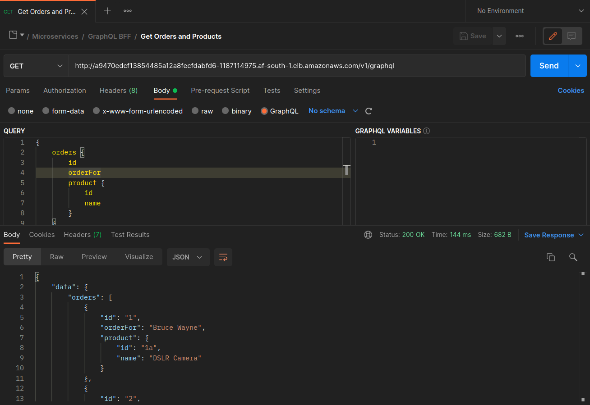

# 비용 최적화 - 네트워킹

고가용성(HA)을 위한 시스템 아키텍처는 복원력과 내결함성을 달성하기 위한 모범 사례를 통해 구현됩니다. 이는 특정 AWS 리전의 여러 가용영역(AZ)에 워크로드와 기본 인프라를 분산시키는 것을 의미합니다. Amazon EKS 환경에 이러한 특성을 적용하면 시스템의 전반적인 안정성이 향상됩니다. 이와 함께 EKS 환경은 다양한 구조(예: VPC), 구성 요소(예: ELB) 및 통합(예: ECR 및 기타 컨테이너 레지스트리)으로 구성될 가능성이 높습니다. 

고가용성 시스템과 기타 사용 사례별 구성 요소의 조합은 데이터 전송 및 처리 방식에 중요한 역할을 할 수 있습니다.이는 결국 데이터 전송 및 처리로 인해 발생하는 비용에도 영향을 미칩니다. 

아래에 자세히 설명된 실천사항은 다양한 도메인 및 사용 사례에서 비용 효율성을 달성하기 위해 EKS 환경을 설계하고 최적화하는 데 도움이 됩니다.


## 파드 간 통신

설정에 따라 파드 간 네트워크 통신 및 데이터 전송은 Amazon EKS 워크로드 실행의 전체 비용에 상당한 영향을 미칠 수 있습니다.이 섹션에서는 고가용성 (HA) 아키텍처, 애플리케이션 성능 및 복원력을 고려하면서 파드 간 통신과 관련된 비용을 줄이기 위한 다양한 개념과 접근 방식을 다룹니다. 

### 가용영역으로의 트래픽 제한

잦은 이그레스 크로스존 트래픽(AZ 간에 분산되는 트래픽)은 네트워크 관련 비용에 큰 영향을 미칠 수 있습니다. 다음은 EKS 클러스터의 파드 간 크로스 존 트래픽 양을 제어하는 방법에 대한 몇 가지 전략입니다. 

_클러스터 내 파드 간 크로스-존 트래픽 양(예: 전송된 데이터 양 또는 바이트 단위 전송)을 세밀하게 파악하려면 [이 게시물 참조](https://aws.amazon.com/blogs/containers/getting-visibility-into-your-amazon-eks-cross-az-pod-to-pod-network-bytes/)하세요._

**Topology Aware Routing (이전 명칭은 Topology Aware Hint) 활용**


Topology Aware Routing을 사용할 때는 트래픽을 라우팅할 때 서비스, EndpointSlices 및 `kube-proxy`가 함께 작동하는 방식을 이해하는 것이 중요합니다. 위 다이어그램에서 볼 수 있듯이 서비스는 파드로 향하는 트래픽을 수신하는 안정적인 네트워크 추상화 계층입니다. 서비스가 생성되면 여러 EndpointSlices가 생성됩니다. 각 EndpointSlice에는 실행 중인 노드 및 추가 토폴로지 정보와 함께 파드 주소의 하위 집합이 포함된 엔드포인트 목록이 있습니다. `kube-proxy`는 클러스터의 모든 노드에서 실행되고 내부 라우팅 역할도 수행하는 데몬셋이지만, 생성된 EndpointSlices에서 소비하는 양을 기반으로 합니다.

[*Topology aware routing*](https://kubernetes.io/docs/concepts/services-networking/topology-aware-routing/)을 활성화하고 쿠버네티스 서비스에 구현하면, EndpointSlices 컨트롤러는 클러스터가 분산되어 있는 여러 영역에 비례적으로 엔드포인트를 할당합니다. EndpointSlices 컨트롤러는 각 엔드포인트에 대해 영역에 대한 _힌트_ 도 설정합니다. _힌트_ 는 엔드포인트가 트래픽을 처리해야 하는 영역을 설명합니다.그러면 `kube-proxy`가 적용된 _힌트_ 를 기반으로 영역에서 엔드포인트로 트래픽을 라우팅합니다. 

아래 다이어그램은 'kube-proxy'가 영역 출발지를 기반으로 가야 할 목적지를 알 수 있도록 힌트가 있는 EndpointSlice를 구성하는 방법을 보여줍니다. 힌트가 없으면 이러한 할당이나 구성이 없으며 트래픽이 어디에서 오는지에 관계없이 서로 다른 지역 목적지로 프록시됩니다. 


경우에 따라 EndPointSlice 컨트롤러는 다른 영역에 대해 _힌트_ 를 적용할 수 있습니다. 즉, 엔드포인트가 다른 영역에서 발생하는 트래픽을 처리하게 될 수 있습니다. 이렇게 하는 이유는 서로 다른 영역의 엔드포인트 간에 트래픽을 균일하게 분배하기 위함입니다.

다음은 서비스에 대해 _토폴로지 인식 라우팅_ 을 활성화하는 방법에 대한 코드 스니펫입니다. 

```yaml hl_lines="6-7"
apiVersion: v1
kind: Service
metadata:
  name: orders-service
  namespace: ecommerce
    annotations:
      service.kubernetes.io/topology-mode: Auto
spec:
  selector:
    app: orders
  type: ClusterIP
  ports:
  - protocol: TCP
    port: 3003
    targetPort: 3003
```

아래 스크린샷은 EndpointSlices 컨트롤러가 `eu-west-1a`가용영역에서 실행되는 파드 복제본의 엔드포인트에 힌트를 성공적으로 적용한 결과를 보여준다. 


!!! note
    Topology aware routing이 아직 **베타**라는 것 인지해야 합니다. 또한 워크로드가 클러스터 토폴로지 전체에 광범위하고 균등하게 분산되어 있을 때 이 기능을 더 잘 예측할 수 있습니다. 따라서 [파드 토폴로지 확산 제약](https://kubernetes.io/docs/concepts/scheduling-eviction/topology-spread-constraints/)과 같이 애플리케이션의 가용성을 높이는 일정 제약과 함께 사용하는 것이 좋습니다.

**오토스케일러 사용: 특정 가용영역에 노드 프로비저닝**

여러 가용영역의 고가용성 환경에서 워크로드를 실행하는 것을 _강력히 권장_ 합니다. 이렇게 하면 애플리케이션의 안정성이 향상되며, 특히 가용영역에 문제가 발생한 경우 더욱 그렇습니다. 네트워크 관련 비용을 줄이기 위해 안정성을 희생하려는 경우 노드를 단일 가용영역로 제한할 수 있습니다. 

동일한 가용영역에서 모든 파드를 실행하려면 동일한 가용영역에 워커 노드를 프로비저닝하거나 동일한 가용영역에서 실행되는 워커 노드에 파드를 스케줄링해야 합니다. 단일 가용영역 내에서 노드를 프로비저닝하려면 [Cluster Autoscaler (CA)](https://github.com/kubernetes/autoscaler/tree/master/cluster-autoscaler)를 사용하여 동일한 가용영역에 속하는 서브넷으로 노드 그룹을 정의하십시오. [Karpenter](https://karpenter.sh/)의 경우 "[_topology.kubernetes.io/zone"_](http://topology.kubernetes.io/zone%E2%80%9D)을 사용하고 워커 노드를 만들려는 가용영역를 지정합니다. 예를 들어 아래 카펜터 프로비저닝 스니펫은 us-west-2a 가용영역의 노드를 프로비저닝합니다.

**Karpenter**

```yaml hl_lines="5-9"
apiVersion: karpenter.sh/v1alpha5
kind: Provisioner
metadata:
name: single-az
spec:
  requirements:
  - key: "topology.kubernetes.io/zone"
    operator: In
    values: ["us-west-2a"]
```

**Cluster Autoscaler (CA)**

```yaml hl_lines="7-8"
apiVersion: eksctl.io/v1alpha5
kind: ClusterConfig
metadata:
  name: my-ca-cluster
  region: us-east-1
  version: "1.21"
availabilityZones:
- us-east-1a
managedNodeGroups:
- name: managed-nodes
  labels:
    role: managed-nodes
  instanceType: t3.medium
  minSize: 1
  maxSize: 10
  desiredCapacity: 1
...
```

**파드 할당 및 노드 어피니티 사용**

또는 여러 가용영역에서 실행되는 워커 노드가 있는 경우 각 노드에는 가용영역 값(예: us-west-2a 또는 us-west-2b)과 함께 _[topology.kubernetes.io/zone](http://topology.kubernetes.io/zone%E2%80%9D)_ 레이블이 붙습니다.`nodeSelector` 또는 `nodeAffinity`를 활용하여 단일 가용영역의 노드에 파드를 스케줄링할 수 있습니다. 예를 들어, 다음 매니페스트 파일은 가용영역 us-west-2a에서 실행되는 노드 내에서 파드를 스케줄링한다.

```yaml hl_lines="7-9"
apiVersion: v1
kind: Pod
metadata:
  name: nginx
  labels:
    env: test
spec:
  nodeSelector:
    topology.kubernetes.io/zone: us-west-2a
  containers:
  - name: nginx
    image: nginx 
    imagePullPolicy: IfNotPresent
```

### 노드로의 트래픽 제한

존 레벨에서 트래픽을 제한하는 것만으로는 충분하지 않은 경우가 있습니다. 비용 절감 외에도 상호 통신이 빈번한 특정 애플리케이션 간의 네트워크 지연 시간을 줄여야 하는 추가 요구 사항이 있을 수 있습니다. 최적의 네트워크 성능을 달성하고 비용을 절감하려면 트래픽을 특정 노드로 제한하는 방법이 필요합니다. 예를 들어 마이크로서비스 A는 고가용성(HA)설정에서도 항상 노드 1의 마이크로서비스 B와 통신해야 합니다. 노드 1의 마이크로서비스 A가 노드 2의 마이크로서비스 B와 통신하도록 하면 특히 노드 2가 완전히 별도의 AZ에 있는 경우 이러한 성격의 애플리케이션에 필요한 성능에 부정적인 영향을 미칠 수 있습니다. 

**서비스 내부 트래픽 정책 사용**

파드 네트워크 트래픽을 노드로 제한하려면 _[서비스 내부 트래픽 정책](https://kubernetes.io/docs/concepts/services-networking/service-traffic-policy/)_ 을 사용할 수 있습니다. 기본적으로 워크로드 서비스로 전송되는 트래픽은 생성된 여러 엔드포인트에 무작위로 분산됩니다. 따라서 HA 아키텍처에서는 마이크로서비스 A의 트래픽이 여러 AZ의 특정 노드에 있는 마이크로서비스 B의 모든 복제본으로 이동할 수 있습니다. 하지만 서비스의 내부 트래픽 정책을 `local`로 설정하면 트래픽이 발생한 노드의 엔드포인트로 트래픽이 제한됩니다. 이 정책은 노드-로컬 엔드포인트를 독점적으로 사용하도록 규정합니다. 암시적으로 보면 해당 워크로드에 대한 네트워크 트래픽 관련 비용이 클러스터 전체에 분산되는 경우보다 낮아질 것입니다.또한 지연 시간이 짧아져 애플리케이션의 성능이 향상됩니다. 

!!! note
    이 기능을 쿠버네티스의 토폴로지 인식 라우팅과 결합할 수 없다는 점에 유의해야 합니다.


다음은 서비스의 _내부 트래픽 정책_ 을 설정하는 방법에 대한 코드 스니펫입니다. 


```yaml hl_lines="14"
apiVersion: v1
kind: Service
metadata:
  name: orders-service
  namespace: ecommerce
spec:
  selector:
    app: orders
  type: ClusterIP
  ports:
  - protocol: TCP
    port: 3003
    targetPort: 3003
  internalTrafficPolicy: Local
```

트래픽 감소로 인한 예상치 못한 애플리케이션 동작을 방지하려면 다음과 같은 접근 방식을 고려해야 합니다:

* 통신하는 각 파드에 대해 충분한 레플리카 실행
* [토폴로지 분산 제약 조건](https://kubernetes.io/docs/concepts/scheduling-eviction/topology-spread-constraints/)을 사용하여 파드를 비교적 균일하게 분산시키십시오.
* 통신하는 파드를 동일한 노드에 배치하기 위해 [파드 어피니티 규칙](https://kubernetes.io/docs/concepts/scheduling-eviction/assign-pod-node/#inter-pod-affinity-and-anti-affinity)을 활용하세요.

이 예에서는 마이크로서비스 A의 복제본 2개와 마이크로서비스 B의 복제본 3개가 있습니다. 마이크로서비스 A의 복제본이 노드 1과 2 사이에 분산되어 있고 마이크로서비스 B의 복제본이 노드 3에 있는 경우 `local` 내부 트래픽 정책 때문에 통신할 수 없습니다. 사용 가능한 노드-로컬 엔드포인트가 없으면 트래픽이 삭제됩니다. 



마이크로서비스 B의 노드 1과 2에 복제본 3개 중 2개가 있는 경우 피어 애플리케이션 간에 통신이 이루어집니다.하지만 통신할 피어 복제본이 없는 마이크로서비스 B의 격리된 복제본은 여전히 남아 있을 것입니다. 


!!! note
    일부 시나리오에서는 위 다이어그램에 표시된 것과 같은 격리된 복제본이 여전히 목적(예: 외부 수신 트래픽의 요청 처리)에 부합한다면 걱정할 필요가 없을 수도 있습니다.

**토폴로지 분산 제약이 있는 서비스 내부 트래픽 정책 사용**

_내부 트래픽 정책_ 을 _토폴로지 확산 제약_ 과 함께 사용하면 서로 다른 노드의 마이크로서비스와 통신하기 위한 적절한 수의 복제본을 확보하는 데 유용할 수 있습니다. 


```yaml hl_lines="16-22"
apiVersion: apps/v1
kind: Deployment
metadata:
  name: express-test
spec:
  replicas: 6
  selector:
    matchLabels:
      app: express-test
  template:
    metadata:
      labels:
        app: express-test
        tier: backend
    spec:
      topologySpreadConstraints:
      - maxSkew: 1
        topologyKey: "topology.kubernetes.io/zone"
        whenUnsatisfiable: ScheduleAnyway
        labelSelector:
          matchLabels:
            app: express-test
```

**파드 어피니티 규칙과 함께 서비스 내부 트래픽 정책 사용**

또 다른 접근 방식은 서비스 내부 트래픽 정책을 사용할 때 파드 어피니티 규칙을 사용하는 것입니다. 파드 어피니티를 사용하면 잦은 통신으로 인해 스케줄러가 특정 파드를 같은 위치에 배치하도록 영향을 줄 수 있다. 특정 파드에 엄격한 스케줄링 제약 조건(`RequiredDuringSchedulingExecutionDuringExecutionDuringIgnored`)을 적용하면, 스케줄러가 파드를 노드에 배치할 때 파드 코로케이션에 대해 더 나은 결과를 얻을 수 있다.

```yaml hl_lines="11-20"
apiVersion: apps/v1
kind: Deployment
metadata:
  name: graphql
  namespace: ecommerce
  labels:
    app.kubernetes.io/version: "0.1.6"
    ...
    spec:
      serviceAccountName: graphql-service-account
      affinity:
        podAffinity:
          requiredDuringSchedulingIgnoredDuringExecution:
          - labelSelector:
              matchExpressions:
              - key: app
                operator: In
                values:
                - orders
            topologyKey: "kubernetes.io/hostname"
```

## 로드밸런서와 파드 통신

EKS 워크로드는 일반적으로 트래픽을 EKS 클러스터의 관련 파드로 분산하는 로드밸런서에 의해 선행됩니다. 아키텍처는 내부 또는 외부 로드밸런서로 구성될 수 있습니다. 아키텍처 및 네트워크 트래픽 구성에 따라 로드밸런서와 파드 간의 통신으로 인해 데이터 전송 요금이 크게 증가할 수 있습니다.

[AWS Load Balancer Controller](https://kubernetes-sigs.github.io/aws-load-balancer-controller)를 사용하여 ELB 리소스 (ALB 및 NLB) 생성을 자동으로 관리할 수 있습니다. 이러한 설정에서 발생하는 데이터 전송 요금은 네트워크 트래픽이 사용한 경로에 따라 달라집니다. AWS Load Balancer Controller는 _인스턴스 모드_ 와 _IP 모드_ 라는 두 가지 네트워크 트래픽 모드를 지원합니다.

_인스턴스 모드_ 를 사용하면 EKS 클러스터의 각 노드에서 NodePort가 열립니다. 그러면 로드밸런서가 노드 전체에서 트래픽을 균등하게 프록시합니다. 노드에 대상 파드가 실행되고 있는 경우 데이터 전송 비용이 발생하지 않습니다. 하지만 대상 파드가 별도의 노드에 있고 트래픽을 수신하는 NodePort와 다른 AZ에 있는 경우 kube-proxy에서 대상 파드로 추가 네트워크 홉이 발생하게 된다. 이러한 시나리오에서는 AZ 간 데이터 전송 요금이 부과됩니다. 노드 전체에 트래픽이 고르게 분산되기 때문에 kube-proxy에서 관련 대상 파드로의 교차 영역 네트워크 트래픽 홉과 관련된 추가 데이터 전송 요금이 부과될 가능성이 높습니다.

아래 다이어그램은 로드밸런서에서 NodePort로, 이후에 `kube-proxy`에서 다른 AZ의 별도 노드에 있는 대상 파드로 이동하는 트래픽의 네트워크 경로를 보여줍니다. 다음은 _인스턴스 모드_ 설정의 예시이다. 


_IP 모드_ 를 사용하면 네트워크 트래픽이 로드밸런서에서 대상 파드로 직접 프록시됩니다. 따라서 이 접근 방식에는 _데이터 전송 요금이 부과되지 않습니다_. 

!!! tip
    데이터 전송 요금을 줄이려면 로드밸런서를 _IP 트래픽 모드_ 로 설정하는 것이 좋습니다. 이 설정에서는 로드밸런서가 VPC의 모든 서브넷에 배포되었는지 확인하는 것도 중요합니다. 

아래 다이어그램은 네트워크 _IP 모드_ 에서 로드밸런서에서 파드로 이동하는 트래픽의 네트워크 경로를 보여줍니다. 


## 컨테이너 레지스트리에서의 데이터 전송

### Amazon ECR

Amazon ECR 프라이빗 레지스트리로의 데이터 전송은 무료입니다. _지역 내 데이터 전송에는 비용이 들지 않습니다_. 하지만 인터넷으로 데이터를 전송하거나 지역 간에 데이터를 전송할 때는 양쪽에 인터넷 데이터 전송 요금이 부과됩니다. 

ECR에 내장된 [이미지 복제 기능](https://docs.aws.amazon.com/AmazonECR/latest/userguide/replication.html)을 활용하여 관련 컨테이너 이미지를 워크로드와 동일한 지역에 복제해야 합니다. 이렇게 하면 복제 비용이 한 번만 청구되고 동일 리전 (리전 내) 이미지를 모두 무료로 가져올 수 있습니다.

_[인터페이스 VPC 엔드포인트](https://docs.aws.amazon.com/whitepapers/latest/aws-privatelink/what-are-vpc-endpoints.html) 를 사용하여 지역 내 ECR 저장소에 연결하면_ ECR에서 이미지를 가져오는 작업 (데이터 전송) 과 관련된 데이터 전송 비용을 더욱 줄일 수 있습니다. NAT 게이트웨이와 인터넷 게이트웨이를 통해 ECR의 퍼블릭 AWS 엔드포인트에 연결하는 대안적인 접근 방식은 더 높은 데이터 처리 및 전송 비용을 발생시킵니다. 다음 섹션에서는 워크로드와 AWS 서비스 간의 데이터 전송 비용 절감에 대해 더 자세히 다루겠습니다. 

특히 큰 이미지로 워크로드를 실행하는 경우, 미리 캐시된 컨테이너 이미지로 사용자 지정 Amazon 머신 이미지 (AMI) 를 구축할 수 있습니다. 이를 통해 초기 이미지 가져오기 시간과 컨테이너 레지스트리에서 EKS 작업자 노드로의 잠재적 데이터 전송 비용을 줄일 수 있습니다. 


## 인터넷 및 AWS 서비스로의 데이터 전송

인터넷을 통해 쿠버네티스 워크로드를 다른 AWS 서비스 또는 타사 도구 및 플랫폼과 통합하는 것은 일반적인 관행입니다. 관련 목적지를 오가는 트래픽을 라우팅하는 데 사용되는 기본 네트워크 인프라는 데이터 전송 프로세스에서 발생하는 비용에 영향을 미칠 수 있습니다.

### NAT 게이트웨이 사용

NAT 게이트웨이는 네트워크 주소 변환 (NAT) 을 수행하는 네트워크 구성 요소입니다. 아래 다이어그램은 다른 AWS 서비스 (Amazon ECR, DynamoDB, S3) 및 타사 플랫폼과 통신하는 EKS 클러스터의 파드를 보여줍니다. 이 예시에서는 파드가 별도의 가용영역에 있는 프라이빗 서브넷에서 실행된다. 인터넷에서 트래픽을 보내고 받기 위해 NAT 게이트웨이가 한 가용영역의 퍼블릭 서브넷에 배포되어 프라이빗 IP 주소를 가진 모든 리소스가 단일 퍼블릭 IP 주소를 공유하여 인터넷에 액세스할 수 있도록 합니다. 이 NAT 게이트웨이는 인터넷 게이트웨이 구성 요소와 통신하여 패킷을 최종 목적지로 전송할 수 있도록 합니다.



이러한 사용 사례에 NAT 게이트웨이를 사용하면 _각 AZ에 NAT 게이트웨이를 배포하여 데이터 전송 비용을 최소화할 수 있습니다._ 이렇게 하면 인터넷으로 라우팅되는 트래픽이 동일한 AZ의 NAT 게이트웨이를 통과하므로 AZ 간 데이터 전송이 방지됩니다.그러나 AZ 간 데이터 전송 비용을 절감할 수는 있지만 이 설정의 의미는 아키텍처에 추가 NAT 게이트웨이를 설치하는 데 드는 비용이 발생한다는 것입니다. 

이 권장 접근 방식은 아래 다이어그램에 나와 있습니다.


### VPC 엔드포인트 사용

이러한 아키텍처에서 비용을 추가로 절감하려면 _[VPC 엔드포인트](https://docs.aws.amazon.com/whitepapers/latest/aws-privatelink/what-are-vpc-endpoints.html)를 사용하여 워크로드와 AWS 서비스 간의 연결을 설정해야 합니다._ VPC 엔드포인트를 사용하면 인터넷을 통과하는 데이터/네트워크 패킷 없이 VPC 내에서 AWS 서비스에 액세스할 수 있습니다. 모든 트래픽은 내부적이며 AWS 네트워크 내에 머물러 있습니다. VPC 엔드포인트에는 인터페이스 VPC 엔드포인트([많은 AWS 서비스에서 지원](https://docs.aws.amazon.com/vpc/latest/privatelink/aws-services-privatelink-support.html))와 게이트웨이 VPC 엔드포인트 (S3 및 DynamoDB에서만 지원)의 두 가지 유형이 있습니다.

**게이트웨이 VPC 엔드포인트**

_게이트웨이 VPC 엔드포인트와 관련된 시간당 또는 데이터 전송 비용은 없습니다._ 게이트웨이 VPC 엔드포인트를 사용할 때는 VPC 경계를 넘어 확장할 수 없다는 점에 유의해야 합니다. VPC 피어링, VPN 네트워킹 또는 Direct Connect를 통해서는 사용할 수 없습니다.

**인터페이스 VPC 엔드포인트**

VPC 엔드포인트에는 [시간당 요금](https://aws.amazon.com/privatelink/pricing/)이 부과되며, AWS 서비스에 따라 기본 ENI를 통한 데이터 처리와 관련된 추가 요금이 부과되거나 부과되지 않을 수 있습니다. 인터페이스 VPC 엔드포인트와 관련된 가용영역 간 데이터 전송 비용을 줄이려면 각 가용영역에 VPC 엔드포인트를 만들 수 있습니다. 동일한 AWS 서비스를 가리키더라도 동일한 VPC에 여러 VPC 엔드포인트를 생성할 수 있습니다.

아래 다이어그램은 VPC 엔드포인트를 통해 AWS 서비스와 통신하는 파드를 보여줍니다.


## VPC 간 데이터 전송

경우에 따라 서로 통신해야 하는 서로 다른 VPC(동일한 AWS 지역 내)에 워크로드가 있을 수 있습니다. 이는 각 VPC에 연결된 인터넷 게이트웨이를 통해 트래픽이 퍼블릭 인터넷을 통과하도록 허용함으로써 달성할 수 있습니다. 이러한 통신은 EC2 인스턴스, NAT 게이트웨이 또는 NAT 인스턴스와 같은 인프라 구성 요소를 퍼블릭 서브넷에 배포하여 활성화할 수 있습니다. 하지만 이러한 구성 요소가 포함된 설정에서는 VPC 내/외부로 데이터를 처리/전송하는 데 비용이 발생합니다. 개별 VPC와 주고받는 트래픽이 AZ 간에 이동하는 경우 데이터 전송 시 추가 요금이 부과됩니다. 아래 다이어그램은 NAT 게이트웨이와 인터넷 게이트웨이를 사용하여 서로 다른 VPC의 워크로드 간에 통신을 설정하는 설정을 보여줍니다. 


### VPC 피어링 연결 

이러한 사용 사례에서 비용을 절감하려면 [VPC 피어링](https://docs.aws.amazon.com/vpc/latest/peering/what-is-vpc-peering.html)을 사용할 수 있습니다. VPC 피어링 연결을 사용하면 동일한 AZ 내에 있는 네트워크 트래픽에 대한 데이터 전송 요금이 부과되지 않습니다. 트래픽이 AZ를 통과하는 경우 비용이 발생합니다. 하지만 동일한 AWS 지역 내의 개별 VPC에 있는 워크로드 간의 비용 효율적인 통신을 위해서는 VPC 피어링 접근 방식을 사용하는 것이 좋습니다. 하지만 VPC 피어링은 전이적 네트워킹을 허용하지 않기 때문에 주로 1:1 VPC 연결에 효과적이라는 점에 유의해야 합니다. 

아래 다이어그램은 VPC 피어링 연결을 통한 워크로드 통신을 개괄적으로 나타낸 것입니다. 


### 트랜지티브(Transitive) 네트워킹 연결

이전 섹션에서 설명한 것처럼 VPC 피어링 연결은 트랜지티브 네트워킹 연결을 허용하지 않습니다. 트랜지티브 네트워킹 요구 사항이 있는 VPC를 3개 이상 연결하려면 [Transit Gateway(TGW)](https://docs.aws.amazon.com/vpc/latest/tgw/what-is-transit-gateway.html)를 사용해야 합니다. 이를 통해 VPC 피어링의 한계 또는 여러 VPC 간의 다중 VPC 피어링 연결과 관련된 운영 오버헤드를 극복할 수 있습니다. TGW로 전송된 데이터에 대해서는 [시간당 요금](https://aws.amazon.com/transit-gateway/pricing/) 이 청구됩니다. _TGW를 통해 이동하는 가용영역 간 트래픽과 관련된 목적지 비용은 없습니다._

아래 다이어그램은 동일한 AWS 지역 내에 있는 서로 다른 VPC에 있는 워크로드 간에 TGW를 통해 이동하는 가용영역 간 트래픽을 보여줍니다.


## 서비스 메시 사용

서비스 메시는 EKS 클러스터 환경에서 네트워크 관련 비용을 줄이는 데 사용할 수 있는 강력한 네트워킹 기능을 제공합니다. 그러나 서비스 메시를 채택할 경우 서비스 메시로 인해 환경에 발생할 수 있는 운영 작업과 복잡성을 신중하게 고려해야 합니다. 

### 가용영역으로의 트래픽 제한

**Istio의 지역성 가중 분포 사용**

Istio를 사용하면 라우팅이 발생한 _이후에_ 트래픽에 네트워크 정책을 적용할 수 있습니다. 이 작업은 [지역 가중 분포](https://istio.io/latest/docs/tasks/traffic-management/locality-load-balancing/distribute/)와 같은 [데스티네이션룰(Destination Rules)](https://istio.io/latest/docs/reference/config/networking/destination-rule/)을 사용하여 수행됩니다. 이 기능을 사용하면 출발지를 기준으로 특정 목적지로 이동할 수 있는 트래픽의 가중치 (백분율로 표시) 를 제어할 수 있습니다. 이 트래픽의 소스는 외부 (또는 공용) 로드밸런서 또는 클러스터 자체 내의 파드에서 발생할 수 있습니다. 모든 파드 엔드포인트를 사용할 수 있게 되면 가중치 기반 라운드로빈 로드 밸런싱 알고리즘을 기반으로 지역이 선택됩니다. 특정 엔드포인트가 비정상이거나 사용할 수 없는 경우, 사용 가능한 엔드포인트에 이러한 변경 사항을 반영하도록 [지역성 가중치가 자동으로 조정됩니다](https://www.envoyproxy.io/docs/envoy/latest/intro/arch_overview/upstream/load_balancing/locality_weight.html). 

!!! note
    지역성 가중 배포를 구현하기 전에 먼저 네트워크 트래픽 패턴과 대상 규칙 정책이 애플리케이션 동작에 미칠 수 있는 영향을 이해해야 합니다.따라서 [AWS X-Ray](https://aws.amazon.com/xray/) 또는 [Jaeger](https://www.jaegertracing.io/)와 같은 도구를 사용하여 분산 추적(트레이싱) 메커니즘을 마련하는 것이 중요합니다. 

위에서 설명한 Istio 대상 규칙을 적용하여 EKS 클러스터의 로드밸런서에서 파드로 이동하는 트래픽을 관리할 수도 있습니다. 가용성이 높은 로드밸런서 (특히 Ingress 게이트웨이) 로부터 트래픽을 수신하는 서비스에 지역성 가중치 배포 규칙을 적용할 수 있습니다. 이러한 규칙을 사용하면 영역 출처 (이 경우에는 로드밸런서) 를 기반으로 트래픽이 어디로 이동하는지 제어할 수 있습니다. 올바르게 구성하면 트래픽을 여러 가용영역의 파드 복제본에 균등하게 또는 무작위로 분배하는 로드밸런서에 비해 이그레스 교차 영역 트래픽이 덜 발생합니다. 

다음은 Istio에 있는 데스티네이션룰 리소스의 코드 블록 예시입니다. 아래에서 볼 수 있듯이 이 리소스는 `eu-west-1` 지역의 서로 다른 3개 가용영역에서 들어오는 트래픽에 대한 가중치 기반 구성을 지정합니다. 이러한 구성은 특정 가용영역에서 들어오는 트래픽의 대부분 (이 경우 70%) 을 해당 트래픽이 발생한 동일한 가용영역의 대상으로 프록시해야 한다고 선언합니다. 

```yaml hl_lines="7-11"
apiVersion: networking.istio.io/v1beta1
kind: DestinationRule
metadata:
  name: express-test-dr
spec:
  host: express-test.default.svc.cluster.local
  trafficPolicy:
    loadBalancer:                        
      localityLbSetting:
        distribute:
        - from: eu-west-1/eu-west-1a/    
          to:
            "eu-west-1/eu-west-1a/*": 70 
            "eu-west-1/eu-west-1b/*": 20
            "eu-west-1/eu-west-1c/*": 10
        - from: eu-west-1/eu-west-1b/*    
          to:
            "eu-west-1/eu-west-1a/*": 20 
            "eu-west-1/eu-west-1b/*": 70
            "eu-west-1/eu-west-1c/*": 10
        - from: eu-west-1/eu-west-1c/*    
          to:
            "eu-west-1/eu-west-1a/*": 20 
            "eu-west-1/eu-west-1b/*": 10
            "eu-west-1/eu-west-1c/*": 70**
    connectionPool:
      http:
        http2MaxRequests: 10
        maxRequestsPerConnection: 10
    outlierDetection:
      consecutiveGatewayErrors: 1
      interval: 1m
      baseEjectionTime: 30s
```

!!! note
    목적지에 분배할 수 있는 최소 가중치는 1% 입니다. 그 이유는 주 대상의 엔드포인트가 정상이 아니거나 사용할 수 없게 되는 경우에 대비하여 장애 조치 리전 및 가용영역을 유지하기 위함입니다.

아래 다이어그램은 _eu-west-1_ 지역에 고가용성 로드 밸런서가 있고 지역 가중 분배가 적용되는 시나리오를 보여줍니다. 이 다이어그램의 대상 규칙 정책은 _eu-west-1a_ 에서 들어오는 트래픽의 60% 를 동일한 AZ의 파드로 전송하도록 구성되어 있는 반면, _eu-west-1a_ 의 트래픽 중 40% 는 eu-west-1b의 파드로 이동해야 한다. 


### 가용 영역 및 노드로의 트래픽 제한

**Istio에서 서비스 내부 트래픽 정책 사용**

파드 간의 _외부_ 수신 트래픽 및 _내부_ 트래픽과 관련된 네트워크 비용을 줄이기 위해 Istio의 대상 규칙과 쿠버네티스 서비스의 _내부 트래픽 정책_ 을 결합할 수 있습니다. Istio 목적지 규칙을 서비스 내부 트래픽 정책과 결합하는 방법은 크게 다음 세 가지 요소에 따라 달라집니다.

* 마이크로서비스의 역할
* 마이크로서비스 전반의 네트워크 트래픽 패턴
* 쿠버네티스 클러스터 토폴로지 전반에 마이크로서비스를 배포하는 방법

아래 다이어그램은 중첩된 요청의 경우 네트워크 흐름이 어떻게 표시되는지와 앞서 언급한 정책이 트래픽을 제어하는 방식을 보여줍니다.



1. 최종 사용자가 **앱 A**에 요청을 보내고, 이 요청은 다시 **앱 C**에 중첩된 요청을 보냅니다. 이 요청은 먼저 가용성이 뛰어난 로드 밸런서로 전송됩니다. 이 로드 밸런서는 위 다이어그램에서 볼 수 있듯이 AZ 1과 AZ 2에 인스턴스가 있습니다.
2. 그런 다음 외부 수신 요청은 Istio 가상 서비스에 의해 올바른 대상으로 라우팅됩니다.
3. 요청이 라우팅된 후 Istio 대상 규칙은 트래픽이 시작된 위치 (AZ 1 또는 AZ 2) 를 기반으로 각 AZ로 이동하는 트래픽 양을 제어합니다. 
4. 그런 다음 트래픽은**앱 A**용 서비스로 이동한 다음 각 Pod 엔드포인트로 프록시됩니다. 다이어그램에서 볼 수 있듯이 수신 트래픽의 80% 는 AZ 1의 파드 엔드포인트로 전송되고, 수신 트래픽의 20% 는 AZ 2로 전송됩니다.
5. 그런 다음 **앱 A**가 내부적으로 **앱 C**에 요청을 보냅니다. **앱 C**의 서비스에는 내부 트래픽 정책이 활성화되어 있습니다(`내부 트래픽 정책``: 로컬`). 
6. **앱 C**에 사용할 수 있는 노드-로컬 엔드포인트가 있기 때문에 **앱 A** (*노드 1*)에서 **앱 C**로의 내부 요청이 성공했습니다. 
7. **앱 C**에 사용할 수 있는 _노드-로컬 엔드포인트_ 가 없기 때문에 **앱 A** (*노드 3)에서 **앱 C**에 대한 내부 요청이 실패합니다. 다이어그램에서 볼 수 있듯이 앱 C의 노드 3에는 복제본이 없습니다.**** 

아래 스크린샷은 이 접근법의 실제 예에서 캡처한 것입니다. 첫 번째 스크린샷 세트는 'graphql'에 대한 성공적인 외부 요청과 'graphql'에서 노드 `ip-10-0-151.af-south-1.compute.internal` 노드에 같은 위치에 있는 `orders` 복제본으로의 성공적인 중첩 요청을 보여줍니다. 




Istio를 사용하면 프록시가 인식하는 모든 [업스트림 클러스터](https://www.envoyproxy.io/docs/envoy/latest/intro/arch_overview/intro/terminology) 및 엔드포인트의 통계를 확인하고 내보낼 수 있습니다. 이를 통해 네트워크 흐름과 워크로드 서비스 간의 분산 점유율을 파악할 수 있습니다. 같은 예제를 계속하면, 다음 명령을 사용하여 `graphql` 프록시가 인식하는 `orders` 엔드포인트를 가져올 수 있습니다.


```bash
kubectl exec -it deploy/graphql -n ecommerce -c istio-proxy -- curl localhost:15000/clusters | grep orders 
```

```bash
...
orders-service.ecommerce.svc.cluster.local::10.0.1.33:3003::**rq_error::0**
orders-service.ecommerce.svc.cluster.local::10.0.1.33:3003::**rq_success::119**
orders-service.ecommerce.svc.cluster.local::10.0.1.33:3003::**rq_timeout::0**
orders-service.ecommerce.svc.cluster.local::10.0.1.33:3003::**rq_total::119**
orders-service.ecommerce.svc.cluster.local::10.0.1.33:3003::**health_flags::healthy**
orders-service.ecommerce.svc.cluster.local::10.0.1.33:3003::**region::af-south-1**
orders-service.ecommerce.svc.cluster.local::10.0.1.33:3003::**zone::af-south-1b**
...
```

이 경우, `graphql` 프록시는 노드를 공유하는 복제본의 `orders` 엔드포인트만 인식합니다. 주문 서비스에서 `InternalTrafficPolicy: Local` 설정을 제거하고 위와 같은 명령을 다시 실행하면 결과는 서로 다른 노드에 분산된 복제본의 모든 엔드포인트를 반환합니다. 또한 각 엔드포인트의 `rq_total`을 살펴보면 네트워크 분배에서 비교적 균일한 점유율을 확인할 수 있습니다. 따라서 엔드포인트가 서로 다른 가용영역에서 실행되는 업스트림 서비스와 연결된 경우 여러 영역에 네트워크를 분산하면 비용이 더 많이 듭니다.

위의 이전 섹션에서 언급한 바와 같이, 파드 어피니티를 활용하여 자주 통신하는 파드를 같은 위치에 배치할 수 있다.

```yaml hl_lines="11-20"
...
spec:
...
  template:
    metadata:
      labels:
        app: graphql
        role: api
        workload: ecommerce
    spec:
      affinity:
        podAffinity:
          requiredDuringSchedulingIgnoredDuringExecution:
          - labelSelector:
              matchExpressions:
              - key: app
                operator: In
                values:
                - orders
            topologyKey: "kubernetes.io/hostname"
      nodeSelector:
        managedBy: karpenter
        billing-team: ecommerce
...
```

`graphql`과 `orders` 복제본이 동일한 노드에 공존하지 않는 경우 (`ip-10-0-0-151.af-south-1.compute.internal`), 아래 포스트맨 스크린샷의 `200 응답 코드`에서 알 수 있듯이 `graphql`에 대한 첫 번째 요청은 성공하지만, `graphql`에서 `orders`로의 두 번째 중첩 요청은 `503 응답 코드`로 실패합니다.  


## 추가 리소스

* [Istio를 사용하여 EKS의 지연 시간 및 데이터 전송 비용 해결](https://aws.amazon.com/blogs/containers/addressing-latency-and-data-transfer-costs-on-eks-using-istio/)
* [Amazon EKS의 네트워크 트래픽에 대한 토폴로지 인식 힌트의 효과 살펴보기](https://aws.amazon.com/blogs/containers/exploring-the-effect-of-topology-aware-hints-on-network-traffic-in-amazon-elastic-kubernetes-service/)
* [Amazon EKS 크로스 가용영역 파드 및 파드 네트워크 바이트에 대한 가시성 확보](https://aws.amazon.com/blogs/containers/getting-visibility-into-your-amazon-eks-cross-az-pod-to-pod-network-bytes/)
* [Istio로 가용영역 트래픽을 최적화하세요](https://youtu.be/EkpdKVm9kQY)
* [토폴로지 인식 라우팅으로 가용영역 트래픽 최적화](https://youtu.be/KFgE_lNVfz4)
* [서비스 내부 트래픽 정책을 통한 쿠버네티스 비용 및 성능 최적화](https://youtu.be/-uiF_zixEro)
* [Istio 및 서비스 내부 트래픽 정책으로 쿠버네티스 비용 및 성능을 최적화합니다.](https://youtu.be/edSgEe7Rihc)
* [공통 아키텍처의 데이터 전송 비용 개요](https://aws.amazon.com/blogs/architecture/overview-of-data-transfer-costs-for-common-architectures/) 
* [AWS 컨테이너 서비스의 데이터 전송 비용 이해](https://aws.amazon.com/blogs/containers/understanding-data-transfer-costs-for-aws-container-services/)
