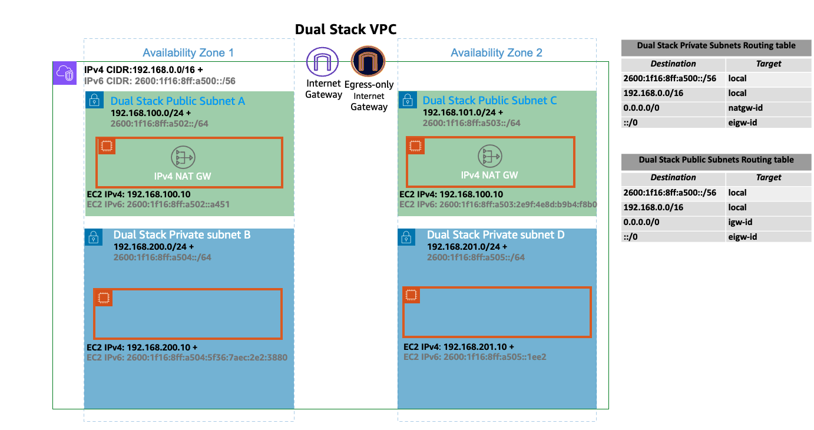
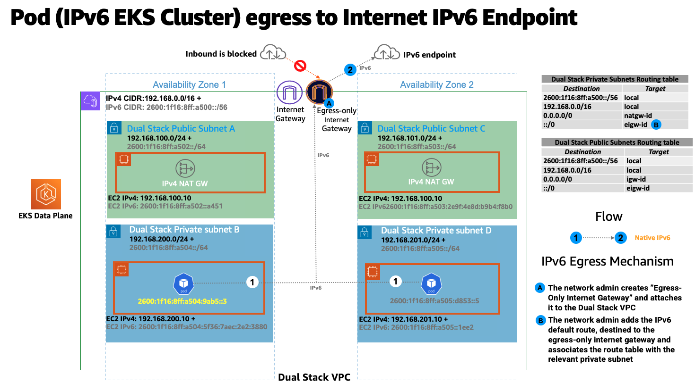
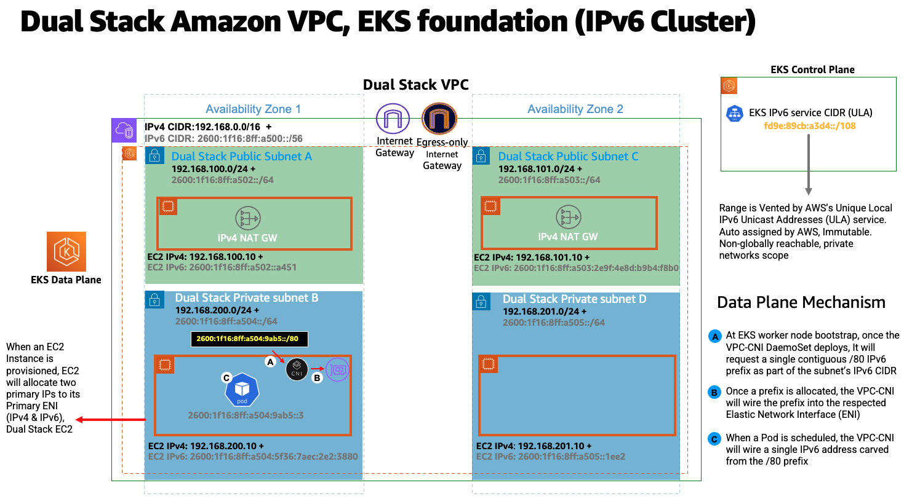
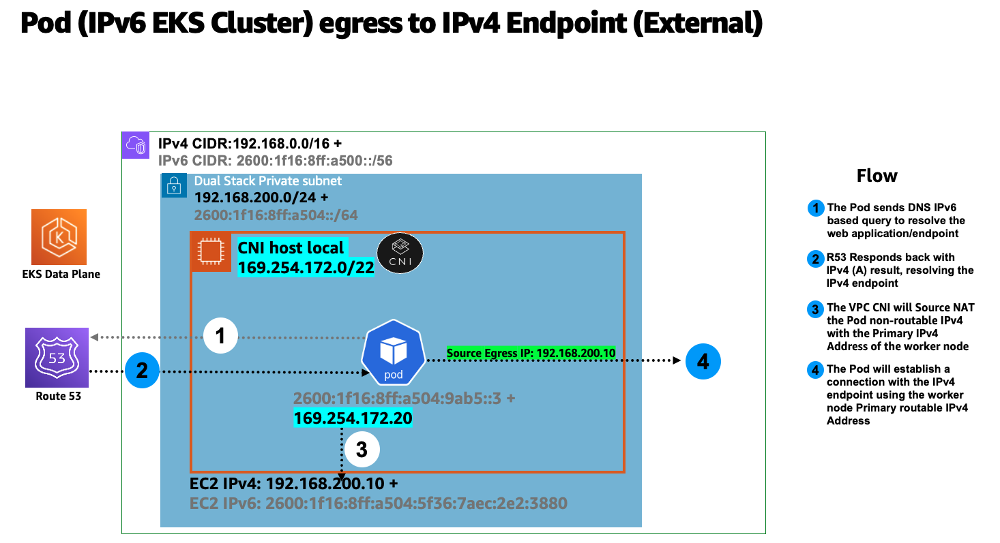
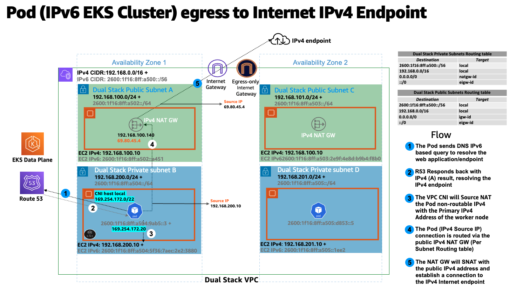
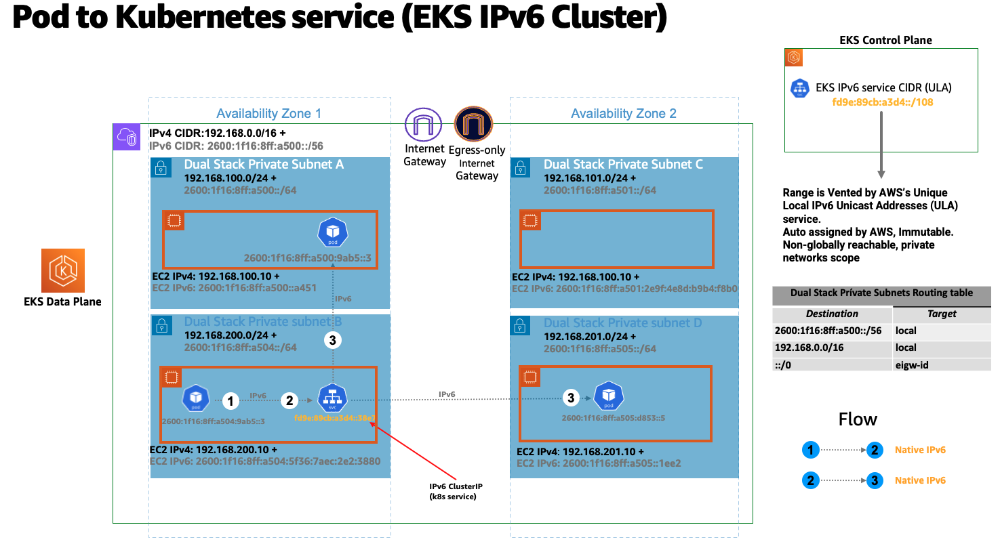
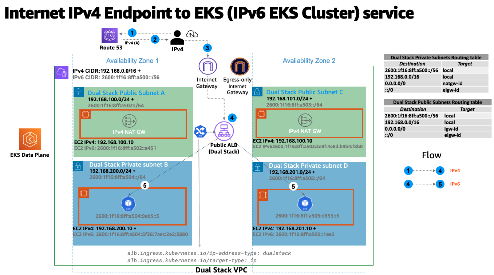

# IPv6 EKS 클러스터 실행

<iframe width="560" height="315" src="https://www.youtube.com/embed/zdXpTT0bZXo" title="YouTube video player" frameborder="0" allow="accelerometer; autoplay; clipboard-write; encrypted-media; gyroscope; picture-in-picture; web-share" allowfullscreen></iframe>

IPv6 모드의 EKS는 대규모 EKS 클러스터에서 자주 나타나는 IPv4 고갈 문제를 해결합니다. EKS의 IPv6 지원은 IPv4 주소 공간의 제한된 크기로 인해 발생하는 IPv4 고갈 문제를 해결하는 데 중점을 두고 있습니다. 이는 많은 고객이 제기한 중요한 우려 사항이며 Kubernetes의 “[IPv4/IPv6 이중 스택](https://kubernetes.io/docs/concepts/services-networking/dual-stack/)“ 기능과는 다릅니다.
또한 EKS/IPv6는 IPv6 CIDR을 사용하여 네트워크 경계를 상호 연결할 수 있는 유연성을 제공하므로 CIDR 중복으로 발생할 가능성을 최소화하여 2중 문제(클러스터 내, 클러스터 간)를 해결합니다.
IPv6 EKS 클러스터에서 포드와 서비스는 레거시 IPv4 엔드포인트와의 호환성을 유지하면서 IPv6 주소를 수신합니다. 여기에는 외부 IPv4 엔드포인트가 클러스터 내 서비스에 액세스하는 기능과 포드가 외부 IPv4 엔드포인트에 액세스하는 기능이 포함됩니다.

Amazon EKS IPv6 지원은 네이티브 VPC IPv6 기능을 활용합니다. 각 VPC에는 IPv4 주소 접두사 (CIDR 블록 크기는 /16에서 /28까지 가능) 및 아마존 GUA (글로벌 유니캐스트 주소) 내의 고유한 /56 IPv6 주소 접두사 (고정) 가 할당됩니다. VPC의 각 서브넷에 /64 주소 접두사를 할당할 수 있습니다. 라우팅 테이블, 네트워크 액세스 제어 목록, 피어링, DNS 확인과 같은 IPv4 기능은 IPv6 지원 VPC에서 동일한 방식으로 작동합니다. VPC를 이중 스택 VPC라고 하며 이중 스택 서브넷에 이어 다음 다이어그램은 EK/IPv6 기반 클러스터를 지원하는 IPv4&IPv6 VPC 기반 패턴을 보여줍니다.

IPv6 환경에서는 모든 주소를 인터넷으로 라우팅할 수 있습니다. 기본적으로 VPC는 퍼블릭 GUA 범위에서 IPv6 CIDR을 할당합니다. VPC는 RFC 4193 (fd00: :/8 또는 fc00: :/8) 에 정의된 [고유 로컬 주소 (ULA)](https://en.wikipedia.org/wiki/Unique_local_address) 범위에서 프라이빗 IPv6 주소를 할당하는 것을 지원하지 않습니다. 이는 사용자가 소유한 IPv6 CIDR을 할당하려는 경우에도 마찬가지입니다. VPC에 외부 전용 인터넷 게이트웨이 (EIGW) 를 구현하여 들어오는 트래픽은 모두 차단하면서 아웃바운드 트래픽은 허용함으로써 프라이빗 서브넷에서 인터넷으로 나가는 것을 지원합니다.
다음 다이어그램은 EKS/IPv6 클러스터 내의 Pod IPv6 인터넷 송신 흐름을 보여줍니다.

IPv6 서브넷을 구현하는 모범 사례는 [VPC 사용 설명서](https://docs.aws.amazon.com/whitepapers/latest/ipv6-on-aws/IPv6-on-AWS.html)에서 확인할 수 있습니다.

IPv6 EKS 클러스터에서 노드와 파드는 퍼블릭 IPv6 주소를 갖습니다. EKS는 고유한 로컬 IPv6 유니캐스트 주소 (ULA) 를 기반으로 서비스에 IPv6 주소를 할당합니다. IPv6 클러스터의 ULA 서비스 CIDR은 IPv4와 달리 클러스터 생성 단계에서 자동으로 할당되며 지정할 수 없습니다. 다음 다이어그램은 EKS/IPv6 기반 클러스터 컨트롤 플레인 및 데이터 플랜 기반 패턴을 보여줍니다.

## 개요

EKS/IPv6는 접두사 모드 (VPC-CNI 플러그인 ENI IP 할당 모드) 에서만 지원됩니다. [접두사 모드](https://aws.github.io/aws-eks-best-practices/networking/prefix-mode/index_linux/)에 대해 자세히 알아보십시오.

> 접두사 할당은 Nitro 기반 EC2 인스턴스에서만 작동하므로 EKS/IPv6는 클러스터 데이터 플레인이 EC2 Nitro 기반 인스턴스를 사용하는 경우에만 지원됩니다. 

간단히 말해서 IPv6 접두사가 /80 (작업자 노드당) 이면 최대 10^14 IPv6 주소가 생성되며, 제한 요소는 더 이상 IP가 아니라 파드의 밀도입니다 (참고 자료 기준).

IPv6 접두사 할당은 EKS 작업자 노드 부트스트랩 시에만 발생합니다.
이 동작은 프라이빗 IPv4 주소를 적시에 할당하기 위한 VPC CNI 플러그인 (ipamd) 에서 생성되는 API 호출 속도 제한으로 인해 파드 스케줄링에서 파드 이탈이 심한 EKS/IPv4 클러스터가 종종 지연되는 시나리오를 완화하는 것으로 알려져 있습니다. 또한 VPC-CNI 플러그인 고급 노브 튜닝 [WARM_IP/ENI*, MINIMUM_IP*](https://github.com/aws/amazon-vpc-cni-k8s#warm_ip_target) 을 불필요하게 만드는 것으로 알려져 있습니다.

다음 다이어그램은 IPv6 작업자 노드 ENI (엘라스틱 네트워크 인터페이스) 를 확대한 것입니다.

모든 EKS 작업자 노드에는 해당 DNS 항목과 함께 IPv4 및 IPv6 주소가 할당됩니다. 특정 작업자 노드의 경우 이중 스택 서브넷의 단일 IPv4 주소만 사용됩니다. IPv6에 대한 EKS 지원을 통해 독보적인 외부 전용 IPv4 모델을 통해 IPv4 엔드포인트 (AWS, 온프레미스, 인터넷) 와 통신할 수 있습니다. EKS는 Pod에 IPv4 주소를 할당하고 구성하는 VPC CNI 플러그인의 보조 기능인 호스트-로컬 CNI 플러그인을 구현합니다. CNI 플러그인은 169.254.172.0/22 범위의 파드에 대해 호스트별로 라우팅할 수 없는 IPv4 주소를 할당합니다. 파드에 할당된 IPv4 주소는 *작업자 노드에 고유한* 것으로 *작업자 노드 이외의 다른 주소는 알려지지 않습니다*. 169.254.172.0/22는 대규모 인스턴스 유형을 지원할 수 있는 최대 1024개의 고유한 IPv4 주소를 제공합니다.

다음 다이어그램은 클러스터 경계 외부 (인터넷 아님) 에 있는 IPv4 엔드포인트에 연결하는 IPv6 Pod의 흐름을 보여줍니다.

위 다이어그램에서 파드는 엔드포인트에 대한 DNS 조회를 수행하고, IPv4 “A” 응답을 받으면 파드의 노드 전용 고유 IPv4 주소가 소스 네트워크 주소 변환 (SNAT) 을 통해 EC2 작업자 노드에 연결된 기본 네트워크 인터페이스의 프라이빗 IPv4 (VPC) 주소로 변환됩니다.

또한 EK/IPv6 파드는 퍼블릭 IPv4 주소를 사용하여 인터넷을 통해 IPv4 엔드포인트에 연결해야 비슷한 흐름이 존재할 수 있습니다.
다음 다이어그램은 클러스터 경계 외부의 IPv4 엔드포인트에 연결하는 IPv6 Pod의 흐름을 보여줍니다 (인터넷 라우팅 가능).

위 다이어그램에서 파드는 엔드포인트에 대한 DNS 조회를 수행하고, IPv4 “A” 응답을 받으면 파드의 노드 전용 고유 IPv4 주소는 소스 네트워크 주소 변환 (SNAT) 을 통해 EC2 작업자 노드에 연결된 기본 네트워크 인터페이스의 프라이빗 IPv4 (VPC) 주소로 변환됩니다. 그런 다음 포드 IPv4 주소 (소스 IPv4: EC2 기본 IP) 는 IPv4 NAT 게이트웨이로 라우팅되며, 여기서 EC2 기본 IP는 유효한 인터넷 라우팅 가능한 IPv4 퍼블릭 IP 주소 (NAT 게이트웨이 할당 퍼블릭 IP) 로 변환됩니다.

노드 간의 모든 파드 간 통신은 항상 IPv6 주소를 사용합니다. VPC CNI는 IPv4 연결을 차단하면서 IPv6를 처리하도록 iptables를 구성합니다.

쿠버네티스 서비스는 고유한 [로컬 IPv6 유니캐스트 주소 (ULA)](https://datatracker.ietf.org/doc/html/rfc4193) 에서 IPv6 주소 (클러스터IP) 만 수신합니다. IPv6 클러스터용 ULA 서비스 CIDR은 EKS 클러스터 생성 단계에서 자동으로 할당되며 수정할 수 없습니다. 다음 다이어그램은 파드에서 쿠버네티스 서비스로의 흐름을 나타냅니다.

서비스는 AWS 로드 밸런서를 사용하여 인터넷에 노출됩니다. 로드 밸런서는 퍼블릭 IPv4 및 IPv6 주소, 즉 듀얼 스택 로드 밸런서를 수신합니다. IPv6 클러스터 쿠버네티스 서비스에 액세스하는 IPv4 클라이언트의 경우 로드 밸런서는 IPv4에서 IPv6으로의 변환을 수행합니다.

Amazon EKS는 프라이빗 서브넷에서 워커 노드와 파드를 실행할 것을 권장합니다. 퍼블릭 서브넷에 퍼블릭 로드 밸런서를 생성하여 프라이빗 서브넷에 있는 노드에서 실행되는 파드로 트래픽을 로드 밸런싱할 수 있습니다.
다음 다이어그램은 EKS/IPv6 인그레스 기반 서비스에 액세스하는 인터넷 IPv4 사용자를 보여줍니다.

> 참고: 위 패턴을 사용하려면 AWS 로드 밸런서 컨트롤러의 [최신 버전](https://kubernetes-sigs.github.io/aws-load-balancer-controller)을 배포해야 합니다.

### EKS 컨트롤 플레인 <-> 데이터 플레인 통신

EKS는 듀얼 스택 모드 (IPv4/IPv6) 에서 크로스 어카운트 ENI (X-eni) 를 프로비저닝할 예정입니다. kubelet 및 kube-proxy와 같은 쿠버네티스 노드 구성 요소는 이중 스택을 지원하도록 구성되어 있습니다. Kubelet과 kube-proxy는 호스트네트워크 모드에서 실행되며 노드의 기본 네트워크 인터페이스에 연결된 IPv4 및 IPv6 주소 모두에 바인딩됩니다. 쿠버네티스 API 서버는 IPv6 기반인 X-ENI를 통해 파드 및 노드 컴포넌트와 통신합니다. 파드는 X-ENI를 통해 API 서버와 통신하며, 파드와 API-서버 간 통신은 항상 IPv6 모드를 사용한다.

## 권장 사항

### IPv4 EKS API에 대한 액세스 유지

EKS API는 IPv4에서만 액세스할 수 있습니다. 여기에는 클러스터 API 엔드포인트도 포함됩니다. IPv6 전용 네트워크에서는 클러스터 엔드포인트와 API에 액세스할 수 없습니다. 네트워크는 (1) IPv6와 IPv4 호스트 간의 통신을 용이하게 하는 NAT64/DNS64와 같은 IPv6 전환 메커니즘과 (2) IPv4 엔드포인트의 변환을 지원하는 DNS 서비스를 지원해야 합니다.

### 컴퓨팅 리소스 기반 일정

단일 IPv6 접두사는 단일 노드에서 많은 파드를 실행하기에 충분하다.또한 이는 노드의 최대 포드 수에 대한 ENI 및 IP 제한을 효과적으로 제거합니다. IPv6는 최대 POD에 대한 직접적인 종속성을 제거하지만 m5.large와 같은 작은 인스턴스 유형에 접두사 첨부 파일을 사용하면 IP 주소를 모두 사용하기 훨씬 전에 인스턴스의 CPU와 메모리 리소스가 고갈될 수 있습니다. 자체 관리형 노드 그룹 또는 사용자 지정 AMI ID가 있는 관리형 노드 그룹을 사용하는 경우 EKS 권장 최대 파드 값을 직접 설정해야 합니다.

다음 공식을 사용하여 IPv6 EKS 클러스터의 노드에 배포할 수 있는 최대 파드 수를 결정할 수 있습니다.

* ((인스턴스 유형별 네트워크 인터페이스 수 (네트워크 인터페이스당 접두사 수-1)* 16) + 2

* ((3 ENIs)*((10 secondary IPs per ENI-1)* 16)) + 2 = 460 (real)

관리형 노드 그룹은 자동으로 최대 파드 수를 계산합니다. 리소스 제한으로 인한 파드 스케줄링 실패를 방지하려면 최대 파드 수에 대한 EKS 권장값을 변경하지 마세요.

### 기존의 사용자 지정 네트워킹의 목적 평가

[사용자 지정 네트워킹](https://aws.github.io/aws-eks-best-practices/networking/custom-networking/)이 현재 활성화되어 있는 경우 Amazon EKS는 IPv6에서 해당 네트워킹 요구 사항을 재평가할 것을 권장합니다. IPv4 고갈 문제를 해결하기 위해 사용자 지정 네트워킹을 사용하기로 선택한 경우 IPv6에서는 더 이상 사용자 지정 네트워킹을 사용할 필요가 없습니다. 사용자 지정 네트워킹을 사용하여 보안 요구 사항(예: 노드와 파드를 위한 별도의 네트워크)을 충족하는 경우 [EKS 로드맵 요청](https://github.com/aws/containers-roadmap/issues)을 제출하는 것이 좋습니다.

### EKS/IPv6 클러스터의 파게이트 포드

EKS는 파게이트에서 실행되는 파드용 IPv6를 지원합니다. Fargate에서 실행되는 파드는 VPC CIDR 범위 (IPv4&IPv6) 에서 분할된 IPv6 및 VPC 라우팅 가능한 프라이빗 IPv4 주소를 사용합니다. 간단히 말해서 EKS/Fargate 포드 클러스터 전체 밀도는 사용 가능한 IPv4 및 IPv6 주소로 제한됩니다. 향후 성장에 대비하여 듀얼 스택 서브넷/vPC CIDR의 크기를 조정하는 것이 좋습니다. 기본 서브넷에 사용 가능한 IPv4 주소가 없으면 IPv6 사용 가능 주소와 상관없이 새 Fargate Pod를 예약할 수 없습니다.

### AWS 로드 밸런서 컨트롤러 (LBC) 배포

**업스트림 인트리 쿠버네티스 서비스 컨트롤러는 IPv6을 지원하지 않습니다**. AWS 로드 밸런서 컨트롤러 애드온의 [최신 버전](https://kubernetes-sigs.github.io/aws-load-balancer-controller)을 사용하는 것이 좋습니다.LBC는 `"alb.ingress.kubernetes.io/ip-address type: dualstack"` 및 `"alb.ingress.kubernetes.io/target-type: ip""라는 주석이 달린 해당 쿠버네티스 서비스/인그레스 정의를 사용하는 경우에만 이중 스택 NLB 또는 이중 스택 ALB를 배포합니다.

AWS 네트워크 로드 밸런서는 듀얼 스택 UDP 프로토콜 주소 유형을 지원하지 않습니다. 지연 시간이 짧은 실시간 스트리밍, 온라인 게임 및 IoT에 대한 강력한 요구 사항이 있는 경우 IPv4 클러스터를 실행하는 것이 좋습니다.UDP 서비스의 상태 점검 관리에 대한 자세한 내용은 [“UDP 트래픽을 쿠버네티스로 라우팅하는 방법”](https://aws.amazon.com/blogs/containers/how-to-route-udp-traffic-into-kubernetes/)을 참조하십시오.

### IMDSv2에 대한 의존성

IPv6 모드의 EKS는 아직 IMDSv2 엔드포인트를 지원하지 않습니다. IMDSv2가 EKS/IPv6으로 마이그레이션하는 데 방해가 되는 경우 지원 티켓을 여십시오.
